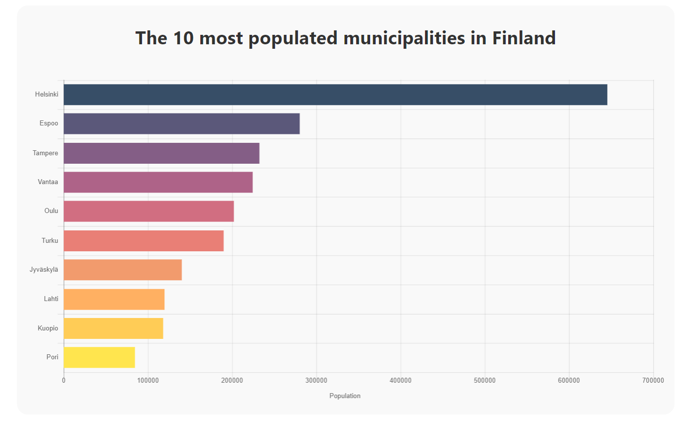

# CHART.JS DATA VISUALIZATION #

The 10 most populated municipalities in Finland visualized with Chart.js and by using React framework. [App is hosted with Heroku.](https://municipalities-of-finland.herokuapp.com/)

This project was bootstrapped with [Create React App](https://github.com/facebook/create-react-app).
